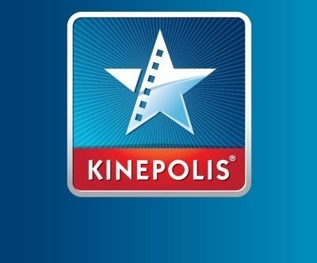

# 🎬 Box Office of a Cinema

An project simulating a cinema ticket sales system developed in Java using Servlets and multi-threading.  
The application manages ticket purchases through a client-server architecture with a graphical interface and thread-based concurrency.



---

## 📱 Key Features

- ✅ Client-server communication using Java Servlets and sockets  
- 🖥️ Multi-threaded handling of client processes  
- 🎟️ Simulation of cinema ticket purchase and seat management  
- 🖼️ Basic graphical interface for user interactions  
- 🔐 Session management and synchronization of concurrent purchases  

---

## 🛠️ Technologies Used

- **Language:** Java  
- **Backend:** Java Servlets  
- **UI:** Java Swing  
- **Concurrency:** Java Threads  
- **Communication:** Sockets  

---

## 🧠 Learning Outcomes and Goals

This project was developed as part of an academic course to practice server-client communication in Java, multithreading, and GUI development. It demonstrates how to build a simple yet functional ticket booking system with proper thread management and data synchronization.

---

## 👨‍💻 Author

**Michael Llorens Barberá**  
Full-stack developer | JS, Kotlin, Java, Python, PHP, Hibernate, Spring Boot, SQL, and APIs.  
📧 [LinkedIn Profile](https://www.linkedin.com/in/michael-llorens-barbera-32b9272b3/)  
🌐 [My Portfolio](https://github.com/Michael-Llorens)

---

## 📦 Installation

Clone this repository and open it in your favorite Java IDE (Eclipse, IntelliJ IDEA):

```bash
git clone https://github.com/Michael-Llorens/Pryecte_Cine_Servlets.git
